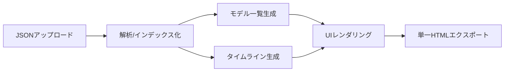

## OpenRouter Chat Viewer

OpenRouter のチャットエクスポートJSONをブラウザで閲覧・比較し、単一HTMLにエクスポートできる軽量ビューアです。処理はすべてクライアントサイドで完結します。

### デモ（GitHub Pages）
- [OpenRouter Chat Viewer (GitHub Pages)](https://check5004.github.io/open-router-chat-viewer/)

### リポジトリ
- [check5004/open-router-chat-viewer](https://github.com/check5004/open-router-chat-viewer)

### 主な特徴
- **ドラッグ&ドロップ/アップロード**: `index.html` を開いてJSONをドロップまたは選択
- **モデル一覧と切替**: 左ペインからモデルごとの応答を切替表示
- **モデル別サマリー**: 総コスト、トークン、応答数、推論時間を集計表示
- **Thinkingの折りたたみ**: 内部思考は `<details>` で必要時のみ展開
- **添付プレビュー**: 画像・PDFなどを履歴内でプレビュー（その他はDLリンク）
- **単一HTMLエクスポート**: ワンクリックで配布可能な単一HTMLを生成
- **安全なMarkdownレンダリング**: `marked` + `DOMPurify` によるサニタイズ

### クイックスタート
1. 上記のデモ（GitHub Pages）を開く、またはこのリポジトリを取得して `index.html` をブラウザで開く
2. チャットJSONをアップロード（またはドラッグ&ドロップ）
3. 左のモデル一覧から表示したいモデルを選択
4. 必要に応じて「HTMLをダウンロード」ボタンで単一HTMLを保存

ヒント: リポジトリにはサンプル `sample/OpenRouter Chat Thu Aug 21 2025.json` が含まれています。

### 仕組み（フロー）


### JSONの想定（要点）
- ルート: `version`, `title`, `characters`, `messages`
- `Message`（抜粋）: `id`, `type (user|assistant|system)`, `characterId`, `parentMessageId`, `content`, `reasoning`, `attachments[]`, `createdAt`, `metadata`
- `metadata`（抜粋）: `variantSlug`, `provider`, `cost`, `tokensCount`, `reasoningDuration`

詳細は `docs/design.md` を参照してください。

### ローカルでの実行
- そのまま `index.html` をダブルクリックして開けます（CDNへアクセスできる環境が必要です）
- 任意の静的サーバでも可

```bash
# 例: Node.js がある場合
npx --yes serve .
```

### GitHub Pages での公開手順
1. リポジトリをGitHubにプッシュ
2. GitHubの `Settings` → `Pages`
3. `Branch: main`、`Folder: /(root)` を選択し保存
4. 数分待つと公開されます（公開URLの例: `https://check5004.github.io/open-router-chat-viewer/`）

### 既知の制限・注意
- エクスポートされた単一HTMLはCDN（`marked`, `DOMPurify`）に依存し、完全オフラインでは動作しません
- 大きなPDF/画像は表示に時間がかかる場合があります（初期は折りたたみ）
- `system` メッセージは表示しません
- **テスト範囲について**: 現時点では「複数モデル」かつ「1件のみのチャット会話」データでの挙動のみ手動検証しています。その他のケースは未検証です。

### 使用ライブラリ
- [marked](https://github.com/markedjs/marked)
- [DOMPurify](https://github.com/cure53/DOMPurify)

### ライセンス
- MIT License。詳細は `LICENSE` を参照してください。


