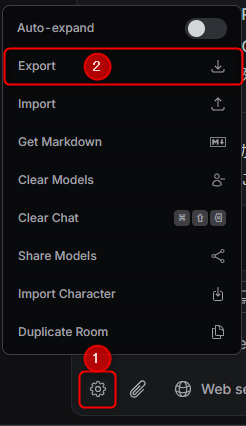
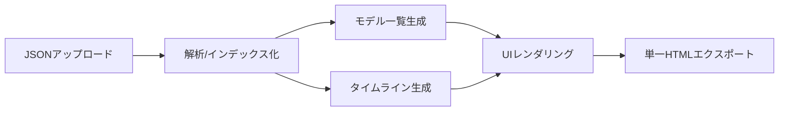

## OpenRouter Chat Viewer

OpenRouter には他者と会話を共有する仕組みがありません。本ツールは、チャット履歴をまるごと UI 付きの単一 HTML に変換し、ファイル 1 つを配るだけでそのまま閲覧できるようにするためのビューアです。インストール不要、ページを開いて JSON を読み込むだけで使え、処理はすべてクライアントサイドで完結します。

## 今すぐ使う
- 👉 **OpenRouter Chat Viewer（サービス）**: [https://check5004.github.io/open-router-chat-viewer/](https://check5004.github.io/open-router-chat-viewer/)
- 👉 **OpenRouter Chat**: [https://openrouter.ai/chat](https://openrouter.ai/chat)

### これは何ができる？（主な機能）
- **ドラッグ&ドロップ/アップロード**: `index.html` を開いてJSONをドロップまたは選択
- **モデルごとの比較表示**: 左ペインからモデルを切り替え、回答を横断確認
- **モデル別サマリー**: 総コスト、トークン、応答数、推論時間を自動集計
- **Thinkingの折りたたみ**: 内部思考は必要なときだけ展開
- **添付プレビュー**: 画像・PDFを履歴内でプレビュー（その他はダウンロードリンク）
- **単一HTMLエクスポート**: ワンクリックで配布可能な単一HTMLを生成
- **安全なMarkdownレンダリング**: `marked` + `DOMPurify` によるサニタイズ

---

### 3分クイックスタート（最短ルート）
1. 上のリンクから[本ビューア（サービス）](https://check5004.github.io/open-router-chat-viewer/)を開く
2. [OpenRouter](https://openrouter.ai/chat) からチャットをエクスポートして JSON を用意（下記参照）
3. その JSON をページにドラッグ&ドロップ or 「ファイルを選択」でアップロード
4. 左のモデル一覧から見たいモデルをクリック
5. 必要なら「HTMLをダウンロード」で単一HTMLとして保存

---

### 共有のしかた
- 「HTMLをダウンロード」で保存した単一 HTML ファイルを、メール/チャット/ファイル共有サービスでそのまま送ってください。
- 受け取った人はブラウザで開くだけで、会話の UI をそのまま閲覧できます。追加インストール不要です。

---

### OpenRouter からチャットをエクスポートする
- OpenRouter Chat: [https://openrouter.ai/chat](https://openrouter.ai/chat)
- 手順: 設定アイコンボタン → Export → JSONファイルのチャットデータがダウンロードされる → これを本アプリにアップロード

---

### 仕組み（フロー）

### よくある質問 / 注意事項
- エクスポートされた単一HTMLはCDN（`marked`, `DOMPurify`）に依存し、完全オフラインでは動作しません
- 大きなPDF/画像は表示に時間がかかる場合があります（初期は折りたたみ）

### 使用ライブラリ
- [marked](https://github.com/markedjs/marked)
- [DOMPurify](https://github.com/cure53/DOMPurify)

### ライセンス
- MIT License。詳細は [LICENSE](LICENSE) を参照してください。

