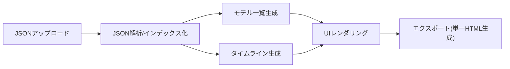
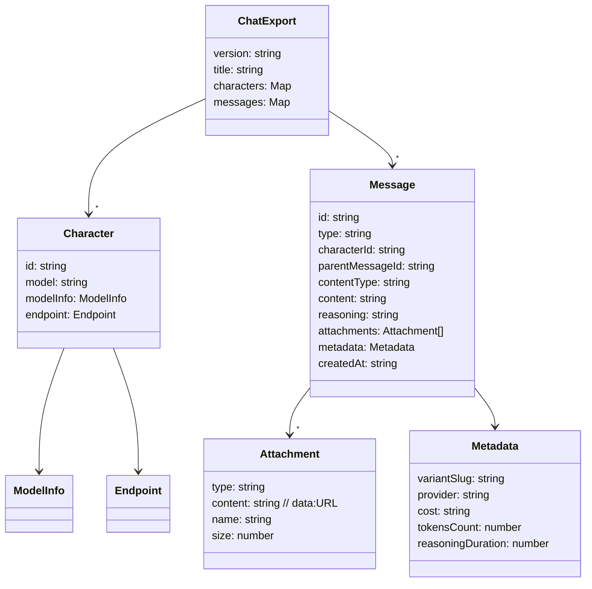

## OpenRouter Chat Viewer 設計書

本ドキュメントは、OpenRouter エクスポートJSON（例: `sample/OpenRouter Chat Thu Aug 21 2025.json`）を静的Webサイトで閲覧・共有可能にするビューアの設計を示す。

### 目的と要件
- JSONは都度アップロードし、解析後にチャット画面HTMLを生成・表示する。
- 生成したHTMLはダウンロードでき、単一ファイルを共有すればチャット履歴を共有できる。
- マークダウン本文は正しくプレビュー表示する（サニタイズ必須）。
- Thinking（推論/内部思考）を折りたたみで表示（初期は閉じる）。
- システムプロンプトは表示しない。
- 左ペインにモデル一覧を表示。初期は先頭モデルを選択し、クリックでそのモデルの出力に切替。
- 各モデルのサマリー（コスト、トークン、応答数、推論時間など）を表示する。
- 画像やPDFなどの添付ファイルも履歴の一部としてプレビュー表示する。

### 想定JSON構造（要点）
ルート:
- `version`, `title`
- `characters: { [characterId]: { id, model, modelInfo, endpoint, ... } }`
- `messages: { [messageId]: Message }`

Message（抜粋）:
- `id`, `type` (例: `user` | `assistant` | `system`)
- `characterId`（`USER` または各モデルのキャラクターID）
- `parentMessageId`（返信先のメッセージID）
- `contentType`（例: `text`）
- `content`（Markdown本文）
- `reasoning`（Thinkingテキスト）
- `attachments: [{ type: "file", content: "data:mime;base64,...", name, size }]`
- `files`（将来拡張 or モデル側のファイル）
- `createdAt`, `updatedAt`
- `metadata: { variantSlug, provider, cost, tokensCount, reasoningDuration, ... }`

メッセージは `messages` マップ内に格納され、ソートは `createdAt` を優先、無ければ `id` の安定ソートにフォールバックする。

### 表示ポリシー
- `user`（または `characterId === "USER"`）の投稿は常に表示。
- `assistant` は左ペインで選択中のモデルのみ表示（同一 `parentMessageId` に複数モデルの応答が紐づくケースを想定）。
- `system` は非表示。
- `content` はMarkdownとしてレンダリング。XSS対策のためサニタイズ必須。
- `reasoning` は `
` 折りたたみ（初期は閉）。Markdownとして任意でレンダリング可。
- 添付：
  - `image/*` はサムネイル表示。
  - `application/pdf` は `<object>`/`<iframe>` でプレビュー（詳細は折りたたみ内に格納）。
  - その他はダウンロードリンク表示。

### UI構成
- ヘッダー：タイトル、ファイルアップロード、エクスポート（ダウンロード）ボタン
- 左ペイン：モデル一覧（アイテム選択で切替）、モデルごとのサマリー
- メイン：タイムライン（ユーザー→選択モデルの応答）

### データモデル（概念）

### レンダリング手順
1. ファイル選択/ドロップでJSON文字列を取得、`JSON.parse`。
2. `characters` を `id` で索引化。
3. `messages` を配列化し、`createdAt` で昇順ソート。
4. `assistant` のみをモデルごとにグルーピング（`metadata.variantSlug` を優先、無ければ `characters[characterId].modelInfo.slug`）。
5. 左ペインにモデル一覧を描画。初期選択は先頭。
6. タイムラインでは、各 `user` メッセージごとに、選択中モデルの `assistant` 応答（`parentMessageId` が一致）を表示。
7. `content` をMarkdown→HTML化し、DOMPurifyでサニタイズして挿入。
8. `reasoning` は `
` 折りたたみでMarkdown表示。
9. 添付ファイルは MIME で分岐してプレビュー/リンクを生成。

### エクスポート設計
- 生成する単一HTMLには以下を内包:
  - チャットJSON（``）
  - 必要なCSS/JS（インライン）。
  - 依存ライブラリはCDNを利用（`marked`, `DOMPurify`）。
- モデル切替/折りたたみ/添付プレビュー等の同等機能を保持。
- ファイル名は `title` をベースにスラグ化し、`.html` を付与。

### セキュリティ
- MarkdownはDOMPurifyでサニタイズして挿入。
- `data:` URL のみを埋め込み許可（外部URLはリンク扱い）。
- 大きなPDF/画像は `
` 配下に置き、初期非表示で負荷・視認性を両立。

### パフォーマンス
- レンダリングは仮想DOM不要のプレーンDOM構築。
- 大量トークン時は `reasoning` とPDFプレビューを折りたたみ既定。

### 既知の制限
- エクスポートHTMLはCDNへのアクセスが必要（オフライン完全対応は将来対応）。
- JSON仕様の変更時はパーサの調整が必要。

